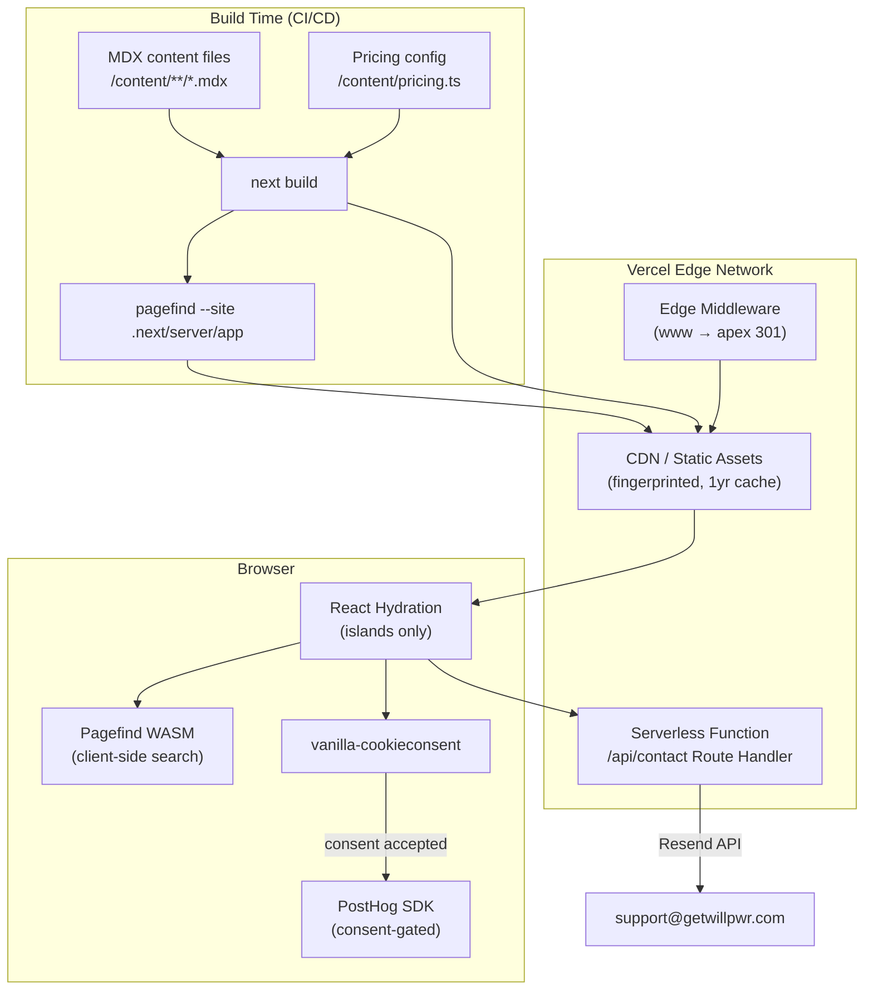

# Design Document: willpwr-website

## Overview

This document describes the technical design for **getwillpwr.com** — the public marketing and product website for Willpwr. The site serves as a conversion-focused marketing hub, self-service help center, legal compliance resource, and trust-building platform. The primary CTA target throughout the site is `willpwr.app/signup`.

### Research Summary

**Framework selection — Next.js App Router over Astro:**
Astro ships zero JavaScript by default and excels at pure content sites, but Next.js App Router with static export (`output: 'export'`) or ISR gives us the same performance profile while keeping the React ecosystem available for interactive islands (lightbox, mobile nav, cookie banner, contact form). Since the Willpwr app is almost certainly React-based, sharing component patterns and design tokens across repos is a practical advantage. Next.js's built-in `next/image` handles WebP/AVIF conversion automatically, its Metadata API generates canonical/OG tags with type safety, and `generateSitemap` covers the sitemap requirement. The performance budget (Lighthouse ≥ 90 mobile) is achievable with Next.js when pages are statically generated and images are optimized.

**Hosting — Vercel:**
Vercel is the natural pairing for Next.js: zero-config deployments, automatic CDN edge distribution, built-in `www` → apex redirect, HTTPS by default, and cache-control headers that satisfy the ≥1yr fingerprinted / ≤1hr non-versioned requirement. Cloudflare Pages is a credible alternative with lower bandwidth costs at scale, but Vercel's Next.js-native support reduces operational friction for a small team.

**Help Center search — Pagefind:**
Pagefind is a fully static, client-side full-text search library that runs as a post-build step, indexing the compiled HTML output. It requires no server, no external API, and adds ~15 KB to the page. Results are returned in under 100 ms for typical documentation corpora, well within the 1-second requirement. It integrates cleanly with Next.js static export via a post-build script.

**Analytics — PostHog:**
PostHog provides page view tracking, session recording, funnel analysis, and conversion events in a single SDK. It supports a consent-gated initialization pattern (`posthog.opt_in_capturing()` / `posthog.opt_out_capturing()`) that satisfies the requirement to not load analytics until consent is given and to stop firing events if consent is withdrawn mid-session. PostHog's EU cloud option simplifies GDPR compliance.

**Cookie consent — vanilla-cookieconsent (orestbida):**
A lightweight (~10 KB gzipped), zero-dependency, GDPR/CCPA-compliant consent management library with category-based consent, 180–365 day persistence, and a customizable UI. It fires callbacks on accept/reject that we use to gate PostHog initialization.

**Email delivery — Resend:**
Resend provides a developer-friendly transactional email API with a React Email template system. A Next.js Route Handler (`/api/contact`) receives form submissions, validates them server-side, and calls the Resend API to deliver to `support@getwillpwr.com`. Honeypot spam protection is implemented at the form level.

**Content authoring — MDX files in `/content`:**
Help Center articles and legal pages are authored as MDX files in a `/content` directory, processed at build time by `next-mdx-remote` or the built-in `@next/mdx` loader. Pricing tier data lives in a JSON/TypeScript config file so tiers can be updated without touching component code.

---

## Architecture

The site is a **statically generated Next.js application** deployed to Vercel. Most pages are pre-rendered at build time (`generateStaticParams` + `export const dynamic = 'force-static'`). The contact form uses a Next.js Route Handler (serverless function) for server-side validation and email delivery. Pagefind search runs entirely client-side from a static index built post-compile.



### Rendering Strategy by Route

| Route | Strategy | Rationale |
|---|---|---|
| `/` | SSG | Static marketing content, maximum CDN cache hit rate |
| `/pricing` | SSG | Data-driven from config file, rebuilt on config change |
| `/help` | SSG | Index of MDX articles, rebuilt on content change |
| `/help/[slug]` | SSG (`generateStaticParams`) | One HTML file per article |
| `/terms` | SSG | Static legal content |
| `/privacy` | SSG | Static legal content |
| `/contact` | SSG + Route Handler | Page is static; form submission hits `/api/contact` |
| `/sitemap.xml` | Generated at build | `next-sitemap` or custom `app/sitemap.ts` |
| `/robots.txt` | Static file in `/public` | Simple text file |
| `404` | Static | Custom `not-found.tsx` |
| `/api/contact` | Serverless Function | Form submission handler |

### Redirect Handler (willpwr.app)

The redirect logic lives in the **willpwr.app codebase**, not this repo. This design documents the contract this site expects:

- Unauthenticated visitors to `willpwr.app/*` (except `/login`, `/signup`, `/reset-password`) are redirected to `https://getwillpwr.com` with all query parameters preserved.
- The redirect preserves UTM parameters: `utm_source`, `utm_medium`, `utm_campaign`, `utm_term`, `utm_content`.
- The redirect is a 302 (temporary) or client-side redirect completing within 1 second.

The URL parameter preservation logic is a pure function testable in the app codebase:

```
redirectUrl(inputUrl: URL): URL
  → copies all searchParams from inputUrl to https://getwillpwr.com + inputUrl.pathname
```

---

## Components and Interfaces

### Component Tree

```
app/
├── layout.tsx              ← Root layout: Nav, Footer, CookieBanner, PostHogProvider
├── page.tsx                ← Homepage
├── pricing/page.tsx
├── help/
│   ├── page.tsx            ← Help Center index
│   └── [slug]/page.tsx     ← Individual article
├── terms/page.tsx
├── privacy/page.tsx
├── contact/page.tsx
├── not-found.tsx
├── sitemap.ts
└── api/
    └── contact/route.ts    ← Form submission handler

components/
├── layout/
│   ├── Nav.tsx
│   ├── MobileMenu.tsx      ← Client component (useState for open/close)
│   └── Footer.tsx
├── home/
│   ├── Hero.tsx
│   ├── Features.tsx
│   ├── Screenshots.tsx
│   ├── Lightbox.tsx        ← Client component
│   ├── Testimonials.tsx
│   └── SecondaryCtaSection.tsx
├── pricing/
│   ├── PricingGrid.tsx
│   ├── PricingCard.tsx
│   ├── BillingToggle.tsx   ← Client component (monthly/annual toggle)
│   └── PricingFaq.tsx
├── help/
│   ├── SearchBar.tsx       ← Client component (Pagefind)
│   ├── CategoryList.tsx
│   └── ArticleLayout.tsx
├── contact/
│   └── ContactForm.tsx     ← Client component (react-hook-form + zod)
├── consent/
│   └── CookieBanner.tsx    ← Client component (vanilla-cookieconsent)
└── analytics/
    └── PostHogProvider.tsx ← Client component (consent-gated)
```

### Key Component Interfaces

#### Nav

```typescript
// No props — reads active route from usePathname()
// Server component wrapper; MobileMenu is a Client component island
export function Nav(): JSX.Element
```

Renders: logo (links to `/`), nav links (`/pricing`, `/help`), "Get Started" button (`willpwr.app/signup`). Collapses to hamburger at `< 768px`.

#### Footer

```typescript
// No props — copyright year computed at render time
export function Footer(): JSX.Element
```

Renders: links to `/terms`, `/privacy`, `/help`, `/pricing`, social media links, dynamic copyright year (`new Date().getFullYear()`).

#### PricingCard

```typescript
interface PricingTier {
  id: string
  name: string
  monthlyPrice: number        // cents, 0 = free
  annualPrice: number | null  // cents, null = no annual option
  features: string[]
  ctaLabel: string
  ctaHref: string             // willpwr.app/signup?plan=X or checkout URL
  isFeatured: boolean
  isFree: boolean
  freeTrialDays: number | null
  featureRestrictions: string[] | null  // populated when isFree = true
  badge: string | null        // e.g. "Most Popular"
}

interface PricingCardProps {
  tier: PricingTier
  billingCycle: 'monthly' | 'annual'
}
```

Savings calculation: `savings = (tier.monthlyPrice * 12) - tier.annualPrice` (displayed only when `billingCycle === 'annual'` and `tier.annualPrice !== null`).

#### ContactForm

```typescript
// Client component — no props
// Uses react-hook-form + zod for validation
// Submits to /api/contact via fetch
export function ContactForm(): JSX.Element
```

Schema:
```typescript
const contactSchema = z.object({
  name:     z.string().min(1).max(100),
  email:    z.string().email(),
  subject:  z.string().min(1).max(150),
  message:  z.string().min(10).max(5000),
  _hp:      z.string().max(0),  // honeypot — must be empty
})
```

#### PostHogProvider

```typescript
interface PostHogProviderProps {
  children: React.ReactNode
}
// Initializes PostHog only after consent is accepted
// Calls posthog.opt_out_capturing() when consent is withdrawn
// Reads consent state from vanilla-cookieconsent's API
```

#### CookieBanner

```typescript
// Client component — no props
// Wraps vanilla-cookieconsent initialization
// Fires onAccept/onReject callbacks that update PostHogProvider consent state
// Stores preference for 180 days (configurable up to 365)
```

---

## Data Models

### Pricing Configuration

Pricing tiers are defined in a TypeScript config file at `content/pricing.ts`. This is the single source of truth — updating this file and redeploying updates the pricing page without any component changes.

```typescript
// content/pricing.ts
export const pricingTiers: PricingTier[] = [
  {
    id: 'free',
    name: 'Free',
    monthlyPrice: 0,
    annualPrice: null,
    features: [
      'Dashboard overview',
      'Basic task management',
      'Calendar sync (Google & Microsoft)',
      'Limited AI messages (50/month)',
    ],
    ctaLabel: 'Get started free',
    ctaHref: 'https://willpwr.app/signup?plan=free',
    isFeatured: false,
    isFree: true,
    freeTrialDays: null,
    featureRestrictions: ['Limited to 50 AI messages/month'],
    badge: null,
  },
  {
    id: 'pro-monthly',
    name: 'Pro Monthly',
    monthlyPrice: 997,       // $9.97 in cents
    annualPrice: null,
    features: [
      '350 AI assistant messages/month',
      'All productivity modules',
      'Email/Image — Gmail & Outlook',
      'Full dashboard customization',
      'SMS, Discord & email notifications',
      'Advanced analytics',
      '90-day planning with AI coaching',
      'Email support',
    ],
    ctaLabel: 'Start Pro Monthly',
    ctaHref: 'https://willpwr.app/signup?plan=pro-monthly',
    isFeatured: false,
    isFree: false,
    freeTrialDays: null,
    featureRestrictions: null,
    badge: null,
  },
  {
    id: 'pro-annual',
    name: 'Pro Annual',
    monthlyPrice: 997,       // $9.97/mo equivalent for savings calc
    annualPrice: 7997,       // $79.97/yr in cents
    features: [
      'Everything in Pro Monthly',
      '3 months free vs monthly billing',
      'Priority email support',
      '250 AI assistant messages/month',
      'Email/Image — Gmail & Outlook',
      'Full dashboard customization',
      'SMS, Discord & email notifications',
      'Advanced analytics',
      '90-day planning with AI coaching',
      'Email support',
    ],
    ctaLabel: 'Start Pro Annual',
    ctaHref: 'https://willpwr.app/signup?plan=pro-annual',
    isFeatured: true,
    isFree: false,
    freeTrialDays: null,
    featureRestrictions: null,
    badge: 'Best Value',
  },
  {
    id: 'lifetime',
    name: 'Lifetime',
    monthlyPrice: 9700,      // $97 one-time, stored as cents for consistency
    annualPrice: null,
    features: [
      '500 AI assistant messages/month',
      'All productivity modules',
      'Email/Image — Gmail & Outlook',
      'Full dashboard customization',
      'SMS, Discord & email notifications',
      'Advanced analytics',
      '90-day planning with AI coaching',
      'All future updates — no renewals',
    ],
    ctaLabel: 'Get Lifetime access',
    ctaHref: 'https://willpwr.app/signup?plan=lifetime',
    isFeatured: false,
    isFree: false,
    freeTrialDays: null,
    featureRestrictions: null,
    badge: null,
  },
]

export const pricingFaq: Array<{ question: string; answer: string }> = [
  {
    question: 'Can I really start for free?',
    answer:
      'Yes. Sign up and get instant access to the dashboard, task manager, and calendar sync at no cost. No credit card required.',
  },
  {
    question: 'What counts as an AI message?',
    answer:
      'Every time you send a message to the AI assistant or ask it to generate tasks, that uses one message. Viewing pages and loading data does not.',
  },
  {
    question: 'Can I cancel my subscription anytime?',
    answer:
      'Yes, cancel at any time from your account settings. You keep access until the end of your billing period.',
  },
  {
    question: "What's the difference between monthly and annual Pro?",
    answer:
      'Annual Pro is billed at $79.97/yr — a 33% discount, roughly $40 savings vs paying $9.97/mo. That\'s two months free.',
  },
  {
    question: 'Is the Lifetime deal really one-time?',
    answer:
      'Yes. Pay once, use Willpwr forever — including all future updates and feature additions.',
  },
  {
    question: 'Do you offer refunds?',
    answer:
      "If you're unsatisfied within 14 days of your first payment, contact us and we'll sort it out.",
  },
]
```

> **Note on Lifetime tier pricing:** The `monthlyPrice` field on the Lifetime tier is set to the one-time price (9700 cents = $97) for data consistency. The `PricingCard` component should detect `id === 'lifetime'` and render it as a one-time price rather than a monthly/annual rate. The savings calculation (Property 6) does not apply to this tier.

### Help Center Content

Articles are MDX files under `content/help/`. Each file exports frontmatter:

```typescript
interface HelpArticleFrontmatter {
  title: string
  category: 'getting-started' | 'account-billing' | 'using-the-app' | string
  description: string   // used as meta description (50–160 chars)
  order: number         // sort order within category
  updatedAt: string     // ISO date string
}
```

Categories are derived at build time by grouping articles by their `category` frontmatter field. A minimum of three categories must be present.

### Homepage Reference Content

Sourced from the Replit prototype screenshots. These are the confirmed copy/content values to use during implementation.

**Hero section:**
- Headline: "Less app-switching. More deep work."
- Sub-headline: "All your tasks, email, calendar, and focus sessions in one place — with an AI assistant that helps you plan, focus, and stay on track."
- Primary CTA: "Get started free" → `https://willpwr.app/signup`
- Secondary CTA: "See pricing" → `/pricing`

**Social proof stats (below hero):**
- 12,000+ users
- 3,400+ tasks logged
- 95% satisfaction
- 4.9/5 rating

**Features section ("One place for the work that matters."):**
- Task management
- AI message (AI assistant)
- Weekly planning
- Focus sessions
- And more / Internet focus (additional modules)

**Focus sessions callout (dark section):**
- Headline: "Focus sessions, not just timers."
- Timer UI mockup showing 15:24

**About page copy:**
- Headline: "We built Willpwr because we needed it."
- Sub-headline: "Every productivity tool we tried was great at one thing. Tasks in one app. Email in another. Calendar somewhere else. And then an AI assistant that knew none of it. Willpwr is our answer: a single place where all of it lives together."
- Problem section headline: "The problem we're solving"
- Left column: "The average knowledge worker checks email dozens of times a day, juggles multiple project management tools, and loses 20–30% of their working time to context-switching. Not because they're undisciplined — but because the tools are fragmented."
- Right column: "Willpwr consolidates your tasks, email inbox, calendar, focus sessions, and 90-day goals into one interface. An AI assistant sits across all of it — so when you ask 'what should I work on today?', it actually knows the answer."
- Beliefs section ("What we believe"):
  - "Deep work over busywork" — The best productivity system is the one that gets you into focused, meaningful work — not one that turns task management into a full-time job.
  - "AI as a thinking partner" — AI should reduce cognitive load, not add it. Willpwr's assistant handles the planning overhead so you can spend your energy on the actual work.
  - "Built for real people" — We're building for people with heavy inboxes, overlapping calendars, and too many open tabs — not idealized productivity gurus.
- Founder quote (John — Founder, john@getwillpwr.com): "I've spent years bouncing between Notion, Todoist, Linear, Gmail, and Google Calendar — plus a handful of AI tools that don't know any of the context those apps hold. Willpwr is my attempt to build the tool I actually wanted: one app, one AI, everything connected. I'm building this for anyone who wants to do serious work without serious overhead. If that's you, I'd love to hear from you."

**Blog sample posts (for seeding initial content):**
- "Stop switching apps. Start doing work." (Productivity, April 28, 2026, 5 min read)
- "90-day planning that actually works (and why most people do it wrong)" (Planning, April 14, 2026, 6 min read)
- "What makes an AI assistant actually useful for productivity?" (AI, March 31, 2026, 4 min read)

**Footer tagline:** "AI-powered productivity for people who want to do their best work."
**Footer nav columns:** Product (Home, Pricing, Launch app), Company (About, Blog)
**Footer bottom:** "© 2026 Willpwr. All rights reserved." | "Built for focus."

---

### Screenshot Data

```typescript
interface Screenshot {
  src: string           // path to image in /public/screenshots/
  alt: string           // max 125 chars
  caption: string       // max 80 chars
  width: number
  height: number
}

// content/screenshots.ts
export const screenshots: Screenshot[] = [
  // minimum 3 entries
]
```

### SEO Metadata

Each page exports a `generateMetadata` function (Next.js App Router convention):

```typescript
// Shared base — extended per page
const baseMetadata = {
  metadataBase: new URL('https://getwillpwr.com'),
  openGraph: {
    siteName: 'Willpwr',
    images: [{ url: '/og-default.png', width: 1200, height: 630 }],
  },
  twitter: { card: 'summary_large_image' },
}
```

Each page provides a unique `title` (10–60 chars) and `description` (50–160 chars). The `canonical` URL is set via `alternates.canonical` in each page's metadata export.

### Cookie Consent State

```typescript
type ConsentCategory = 'necessary' | 'analytics' | 'advertising'

interface ConsentState {
  accepted: ConsentCategory[]
  rejected: ConsentCategory[]
  timestamp: number   // Unix ms
  expiresAt: number   // Unix ms, 180–365 days from timestamp
}
// Stored in a cookie named "cc_cookie" by vanilla-cookieconsent
```

### Contact Form Submission

```typescript
// POST /api/contact — request body
interface ContactSubmission {
  name: string      // 1–100 chars
  email: string     // valid email
  subject: string   // 1–150 chars
  message: string   // 10–5000 chars
  _hp: string       // honeypot — must be empty string
}

// Response
type ContactResponse =
  | { success: true }
  | { success: false; error: string }
```

---

## Correctness Properties

*A property is a characteristic or behavior that should hold true across all valid executions of a system — essentially, a formal statement about what the system should do. Properties serve as the bridge between human-readable specifications and machine-verifiable correctness guarantees.*

This feature involves a mix of UI rendering, data-driven configuration, form validation, and consent management. Property-based testing applies to the pure logic layers: pricing calculations, content data constraints, form validation, SEO metadata bounds, and consent gating. UI rendering and infrastructure requirements are covered by example-based tests and smoke tests.

The property-based testing library for this project is **fast-check** (TypeScript-native, works with Vitest).

---

### Property 1: Signup CTA links target willpwr.app/signup

*For any* signup CTA element rendered on any page of the site, its `href` attribute should equal `https://willpwr.app/signup` (or `https://willpwr.app/signup?plan=X` for plan-specific CTAs) and the element should not have `target="_blank"`.

**Validates: Requirements 2.5**

---

### Property 2: Screenshot captions are within the character limit

*For any* screenshot entry in the `screenshots` content array, its `caption` field should be a non-empty string of no more than 80 characters.

**Validates: Requirements 3.2**

---

### Property 3: Screenshot alt text is present and within the character limit

*For any* screenshot entry in the `screenshots` content array, its `alt` field should be a non-empty string of no more than 125 characters.

**Validates: Requirements 3.5**

---

### Property 4: Screenshot images use next-gen formats

*For any* screenshot rendered in the site, the rendered `` element (or `<source>` within a `<picture>`) should specify a WebP or AVIF source, with a JPEG or PNG fallback available. When using `next/image`, the `src` should point to a JPEG or PNG original and the framework handles format negotiation automatically.

**Validates: Requirements 3.4**

---

### Property 5: Pricing tier config renders all required fields

*For any* pricing tier in the `pricingTiers` config array, the rendered `PricingCard` component should display the tier name, the applicable price (monthly or annual depending on billing toggle state), the complete feature list, and a CTA button.

**Validates: Requirements 4.2**

---

### Property 6: Annual savings calculation is correct

*For any* pricing tier where `annualPrice` is not null, the displayed annual savings should equal `(monthlyPrice × 12) − annualPrice`, and the displayed per-month equivalent should equal `annualPrice / 12` (rounded to the nearest cent).

**Validates: Requirements 4.3**

---

### Property 7: Help article pages always contain a Contact Support link

*For any* help article page rendered from the MDX content collection, the rendered HTML should contain at least one anchor element with `href="/contact"` or `href` containing `/contact`.

**Validates: Requirements 5.5**

---

### Property 8: Footer contains all required links on every page

*For any* page rendered by the site, the rendered footer should contain links to `/terms`, `/privacy`, `/help`, `/pricing`, and at least one external social media URL.

**Validates: Requirements 6.3, 7.3, 9.4**

---

### Property 9: Nav contains all required links on every page

*For any* page rendered by the site, the rendered nav should contain links to `/` (logo), `/pricing`, `/help`, and `https://willpwr.app/signup`.

**Validates: Requirements 9.1**

---

### Property 10: Page titles and meta descriptions are within required bounds

*For any* page in the site, its `<title>` should be between 10 and 60 characters (inclusive), and its `<meta name="description">` content should be between 50 and 160 characters (inclusive). All page titles should be unique across the site.

**Validates: Requirements 10.1**

---

### Property 11: OG tags are present and og:image is an absolute URL

*For any* page in the site, the rendered HTML should contain `og:title`, `og:description`, `og:url`, and `og:image` meta tags, where `og:image` starts with `https://`.

**Validates: Requirements 10.2**

---

### Property 12: Each page has exactly one h1 with no heading level skips

*For any* page in the site, the rendered HTML should contain exactly one `<h1>` element, and the sequence of heading levels (`h1` → `h2` → `h3`) should not skip any level.

**Validates: Requirements 10.5**

---

### Property 13: Canonical tag matches the page's own URL

*For any* page in the site, the `<link rel="canonical">` href should match the page's expected canonical URL (`https://getwillpwr.com` + route path).

**Validates: Requirements 10.6**

---

### Property 14: Analytics scripts are absent when consent is not accepted

*For any* page rendered without a stored analytics consent preference (or with consent rejected), the PostHog script should not be initialized and no analytics network requests should be made.

**Validates: Requirements 8.3, 11.3**

---

### Property 15: Consent preference expiry is within the 180–365 day window

*For any* consent action (accept all, reject non-essential, or customize), the stored consent cookie's expiry should be between 180 and 365 days from the time of the action.

**Validates: Requirements 8.4**

---

### Property 16: Signup CTA clicks fire a conversion event

*For any* signup CTA element on the site, simulating a click (with analytics consent accepted and PostHog initialized) should result in exactly one PostHog `capture` call with the event name `signup_cta_clicked`.

**Validates: Requirements 11.2**

---

### Property 17: UTM parameters are passed to analytics

*For any* set of UTM parameters present in the page URL on load, the PostHog `identify` or page view call should include those UTM parameters in the event properties.

**Validates: Requirements 11.5**

---

### Property 18: Contact form rejects invalid inputs with inline errors

*For any* contact form submission where at least one field violates its constraint (name > 100 chars, invalid email format, subject > 150 chars, message < 10 chars or > 5000 chars), the form should not submit to the server and should display an inline validation error adjacent to the offending field, without reloading the page.

**Validates: Requirements 13.2, 13.4**

---

### Property 19: Honeypot field blocks spam submissions

*For any* contact form submission where the `_hp` honeypot field is non-empty, the `/api/contact` route handler should return a 400 response and not deliver an email.

**Validates: Requirements 13.5**

---

### Property 20: URL query parameters are preserved through the app-to-website redirect

*For any* URL at `willpwr.app` with arbitrary query parameters (including UTM parameters), the redirect destination URL at `getwillpwr.com` should contain all original query parameters with their values unchanged.

**Validates: Requirements 1.2**

> Note: This property is implemented and tested in the **willpwr.app** codebase, not this repo. It is documented here because the redirect contract is a dependency of this site's UTM attribution strategy.

---

## Error Handling

### Contact Form

| Scenario | Handling |
|---|---|
| Client-side validation failure | Inline error messages per field via react-hook-form; no network request made |
| Honeypot field non-empty | Server returns 400; client shows generic error message |
| Resend API failure | Server returns 500; client shows "Something went wrong — please try again" with a retry button |
| Network timeout | Client fetch times out after 10 seconds; shows retry error |
| Rate limiting | Server returns 429; client shows "Too many requests — please wait before trying again" |

### Pricing CTA Navigation

If a pricing CTA link fails to navigate (e.g., `willpwr.app` is unreachable), the browser's default error page is shown. Since these are standard `<a>` tags, no custom error handling is needed beyond the requirement to display an error message with a retry option. This is satisfied by wrapping CTA clicks in an error boundary that catches navigation failures and renders an inline error with a retry link.

### Help Center Search

| Scenario | Handling |
|---|---|
| No results found | Display "No results found for '[query]'" message with a link to `/contact` |
| Pagefind index not loaded | Show a loading spinner; if load fails after 5 seconds, show "Search unavailable — browse categories below" |

### 404 and 5xx Pages

- **404**: Custom `not-found.tsx` with links to `/` and `/help`.
- **500**: Custom `error.tsx` (Next.js App Router error boundary) with a generic message and a link to `/`.

### Analytics Consent Withdrawal

When a visitor withdraws analytics consent mid-session:
1. `posthog.opt_out_capturing()` is called immediately.
2. No further PostHog events are sent for the remainder of the session.
3. The consent cookie is updated with the new preference.

---

## Testing Strategy

### Overview

Testing is split into three layers:

1. **Unit / component tests** — Vitest + React Testing Library. Test individual components with specific examples and edge cases.
2. **Property-based tests** — Vitest + fast-check. Test universal properties across generated inputs (minimum 100 iterations per property).
3. **Smoke / integration tests** — Playwright E2E + Lighthouse CI. Test deployed behavior, performance budgets, and accessibility scores.

### Unit and Component Tests

Focus areas:
- `PricingCard`: renders all required fields for a given tier; savings calculation is correct.
- `ContactForm`: validation errors appear for invalid inputs; honeypot rejection; successful submission flow (mocked fetch).
- `Footer`: contains all required links; copyright year matches current year.
- `Nav`: contains all required links; mobile menu toggles correctly at < 768px.
- `CookieBanner`: renders three consent options; includes `/privacy` link.
- `PostHogProvider`: does not initialize PostHog when consent is absent; calls `opt_out_capturing` when consent is withdrawn.
- `SearchBar`: displays no-results message with `/contact` link when Pagefind returns empty results.

### Property-Based Tests (fast-check)

Each property from the Correctness Properties section is implemented as a single fast-check property test, configured to run a minimum of 100 iterations. Tests are tagged with a comment referencing the design property.

**Tag format:** `// Feature: willpwr-website, Property N: <property text>`

Example:

```typescript
// Feature: willpwr-website, Property 6: Annual savings calculation is correct
it('annual savings calculation is correct for any tier with annual pricing', () => {
  fc.assert(
    fc.property(
      fc.record({
        monthlyPrice: fc.integer({ min: 100, max: 100000 }),
        annualPrice: fc.integer({ min: 100, max: 1000000 }),
      }),
      ({ monthlyPrice, annualPrice }) => {
        const tier = buildTier({ monthlyPrice, annualPrice })
        const { savings, perMonth } = computeAnnualSavings(tier)
        expect(savings).toBe(monthlyPrice * 12 - annualPrice)
        expect(perMonth).toBe(Math.round(annualPrice / 12))
      }
    ),
    { numRuns: 100 }
  )
})
```

Properties 2, 3, 10, 12, 13, 15, 18, 19, and 20 are particularly well-suited to fast-check's string and record generators.

### Smoke and Integration Tests (Playwright + Lighthouse CI)

| Test | Tool | Assertion |
|---|---|---|
| Homepage LCP ≤ 2.5s (mobile) | Lighthouse CI | `lcp <= 2500` |
| Lighthouse Performance ≥ 90 (mobile + desktop) | Lighthouse CI | `performance >= 90` |
| Lighthouse Accessibility ≥ 90 (all pages) | Lighthouse CI | `accessibility >= 90` |
| `/sitemap.xml` is valid XML with all public pages | Playwright | Parse XML, assert URLs |
| `/robots.txt` contains Sitemap directive | Playwright | String assertion |
| HTTP → HTTPS 301 redirect | Playwright | Assert status code |
| `www.getwillpwr.com` → `getwillpwr.com` 301 | Playwright | Assert redirect chain |
| Custom 404 page has links to `/` and `/help` | Playwright | Navigate to `/nonexistent`, assert links |
| Contact form end-to-end (with mocked Resend) | Playwright | Submit valid form, assert confirmation |
| Analytics not loaded without consent | Playwright | Assert PostHog script absent in DOM |
| Cookie banner appears on first visit | Playwright | Assert banner visible, no consent cookie |

### Accessibility

- **Automated**: axe-core integrated into Playwright tests; run on all pages.
- **Manual**: Keyboard navigation walkthrough (Tab, Shift+Tab, Enter, Space, Escape for lightbox/mobile menu).
- **Color contrast**: Verified via Figma/design tokens before implementation; confirmed by Lighthouse accessibility audit.

### Content Validation

A build-time validation script (`scripts/validate-content.ts`) runs as part of `next build` and asserts:
- All screenshot entries have `alt` ≤ 125 chars and `caption` ≤ 80 chars.
- All help article frontmatter has required fields within bounds.
- All page metadata (title, description) is within character limits.
- Pricing config has at least one tier and at least five FAQ entries.

This catches content constraint violations before deployment.
